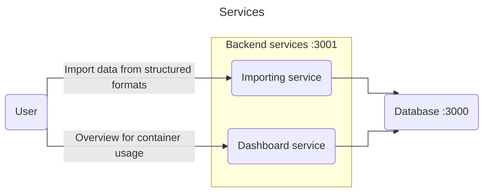

# EuroSkills 2025 Preliminary Round

## Project setup

### Database

To start the development database use the following steps

Requirements: Node

```bash
cd ./Database
npm install
npm start
```

### Backend

#### Development

You can use a Visual Studio instance to open the `./es2025-s09-r1-100.sln` file.

#### Release

```bash
cd ./Backend
dotnet restore
dotnet run -c Release
```

The server will start up on port `:3001`

**Warning!** An instance of database must be running on `:3000` for correct results.

### Tests

To run tests use the following command:

```bash
dotnet restore
dotnet test
```

## Configuration

The program can be configured in a JSON configuration file: `./Backend/appsettings.json`. 

## Architecture




## Development guide

To follow clean architecture the backend and communication as been split into two separate modules: 

`Backend` and `Shared`. Every data that comes in or goes out from the server must be located in `Shared`.

## Integration guide

When started in Development mode the navigation bar will contain a page for API documentation.

## Used technologies

- [.NET 8](https://dotnet.microsoft.com/)
- [Node.js](https://nodejs.org/en)
- [json-server](https://www.npmjs.com/package/json-server)
- [Razor (.NET)](https://learn.microsoft.com/en-us/aspnet/core/razor-pages)
- [Bootstrap](https://getbootstrap.com/)
- [JQuery](https://jquery.com/)
- [AFrame](https://aframe.io/)
- [Datatable](https://datatables.net/)

## Added functionality

This solution works with any size or dimension. The only limitation is that the blocks will be placed in a square shape. Use the configuration file to change the size of blocks or block count. 

## Disclosure

> Data management (Update, delete) would be a separate service sold separately.
